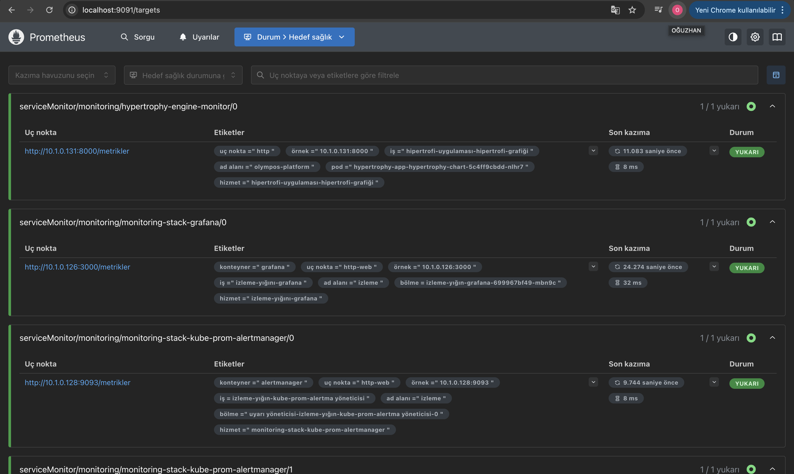
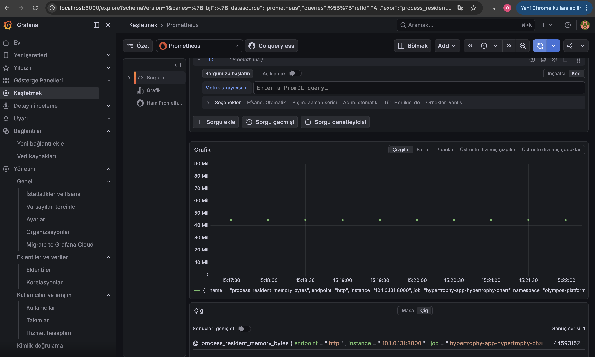

🏗️ Olympos Platform: Advanced Kubernetes Observability Stack
Bu depo, modern bir mikroservis mimarisinin Kubernetes ortamında nasıl yönetildiğini, izlendiğini ve stres testlerine nasıl tepki verdiğini gösteren uçtan uca bir altyapı projesidir. Proje, sadece bir uygulama dağıtımı değil, tam kapsamlı bir Gözlemlenebilirlik (Observability) ekosistemidir.

🎯 Proje Hedefleri ve Stratejik Yaklaşım
Projenin temel amacı, sistem üzerindeki kontrolü en üst seviyeye çıkarmaktır:

Tam Görünürlük: Uygulamanın çalışma anındaki (runtime) davranışlarını metriklerle analiz etmek.

Proaktif Sorun Giderme: Manuel kontrol yerine Prometheus tabanlı otomatik keşif sistemlerini kullanmak.

Performans Doğrulama: Yapılan stres testleri ile sistemin sınırlarını Grafana üzerinde görselleştirmek.

🛠️ Teknik Stack & Altyapı Bileşenleri
Application: FastAPI (Python) - Asenkron ve yüksek performanslı backend.

Orchestration: Kubernetes (K8s) - olympos-platform namespace'i altında izole kaynak yönetimi.

IaC & Automation: Helm & Terraform - Monitoring stack'in (kube-prometheus-stack) standartlaştırılmış kurulumu.

Observability Pipeline:

Prometheus: ServiceMonitor aracılığıyla otomatik hedef keşfi.

Grafana: PromQL tabanlı gelişmiş veri görselleştirme.

🚀 Uygulama ve Operasyonel Detaylar
1. Prometheus Hedef Keşfi (Service Discovery)
Sistemin kalbi olan Prometheus, hypertrophy-engine-monitor tanımlaması sayesinde pod'ları otomatik olarak bulur. Aşağıdaki görselde, uygulamanın metrik uç noktasının (/metrikler) başarıyla tarandığı ve UP statüsünde olduğu görülmektedir:

Görsel: Prometheus'un uygulamayı başarıyla keşfettiği anlık durum.

2. Bellek Analizi (Memory Consumption)
Uygulamanın kaynak tüketimi, process_resident_memory_bytes metrikleri üzerinden izlenmektedir. Yapılan analizlerde uygulamanın kararlı bir şekilde ortalama 44 MB RAM tükettiği doğrulanmıştır:

Görsel: Uygulamanın zaman içindeki kararlı bellek kullanımı.

📈 Sonuç ve Kazanımlar
Bu proje ile;

Kubernetes üzerinde Custom Resource Definitions (CRD) kullanımında uzmanlık sağlanmıştır.

PromQL kullanılarak karmaşık veriler anlamlı dashboardlara dönüştürülmüştür.

Bir uygulamanın yaşam döngüsü, Dockerizasyon aşamasından canlı izleme aşamasına kadar tam otomatize edilmiştir.

Geliştirici: Oğuzhan Özmen

Unvan: Computer Engineering Student | DevOps & Cloud Enthusiast